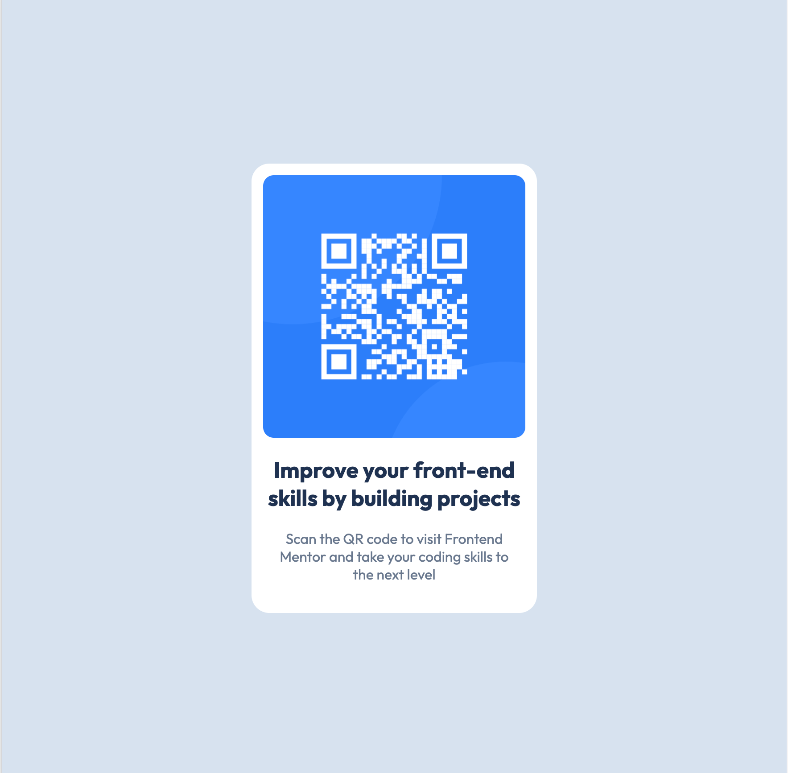

# Frontend Mentor - QR code component solution

This is a solution to the [QR code component challenge on Frontend Mentor](https://www.frontendmentor.io/challenges/qr-code-component-iux_sIO_H). Frontend Mentor challenges help you improve your coding skills by building realistic projects.

## Table of contents

- [Overview](#overview)
  - [Screenshot](#screenshot)
  - [Links](#links)
- [My process](#my-process)
  - [Built with](#built-with)
  - [What I learned](#what-i-learned)
  - [Continued development](#continued-development)
  - [Useful resources](#useful-resources)
- [Author](#author)
- [Acknowledgments](#acknowledgments)

## Overview

### Screenshot

### Links

- Solution URL: (https://github.com/Tainicknackz/qr-code-component)
- Live Site URL: (https://singular-tapioca-43c200.netlify.app/)

## My process

### Built with

- Semantic HTML5 markup
- CSS custom properties
- Flexbox
- Mobile responsive

### What I learned

I learnt how I use combination of CSS properties effectively to center image within its container, resize it to the desired dimensions, and add a rounded border for a polished appearance.

- GitHub - (https://github.com/Tainicknackz)
- Frontend Mentor -(https://www.frontendmentor.io/profile/Tainicknackz)
